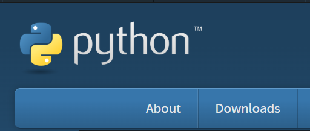

# Python Installation



### Go to

[https://www.python.org/](https://www.python.org/)





### Click on "Downloads"

<figure><figcaption></figcaption></figure>



### Click on "Python Download Manager"

<figure><figcaption></figcaption></figure>



### Enter "Y"





### Check whether installed or not


```
python --version
```



```
pip --version
```




